# IAM Lab Report (Labs 1–12)

**Course:** Identity and Access Management  
**Systems:** AlmaLinux 9, CentOS 7, Ubuntu 22.04 virtual machines  

## Table of contents

1. [Lab 1 – Assigning limited sudo privileges](#lab-1--assigning-limited-sudo-privileges)
2. [Lab 2 – Disabling the sudo timer](#lab-2--disabling-the-sudo-timer)
3. [Lab 3 – Encrypted home directory](#lab-3--encrypted-home-directory)
4. [Lab 4 – Password complexity criteria](#lab-4--password-complexity-criteria)
5. [Lab 5 – Account and password expiry](#lab-5--account-and-password-expiry)
6. [Lab 6 – Detecting compromised passwords](#lab-6--detecting-compromised-passwords)
7. [Lab 7 – Configuring pam_tally2](#lab-7--configuring-pam_tally2)
8. [Lab 8 – Distributed identity management](#lab-8--distributed-identity-management)
9. [Lab 9 – SUID and SGID files](#lab-9--suid-and-sgid-files)
10. [Lab 10 – File attributes](#lab-10--file-attributes)
11. [Lab 11 – Shared group directory](#lab-11--shared-group-directory)
12. [Lab 12 – SELinux type enforcement](#lab-12--selinux-type-enforcement)
13. [Overall conclusion](#overall-conclusion-strengthening-the-linux-security-perimeter)

---

## Lab 1 – Assigning limited sudo privileges

### Objective

Understand how to manage user privileges in Linux by assigning different levels of administrative access using `sudo`.

### Background

Administrative privileges are controlled with `sudo`. Instead of granting full root access, `sudo` allows fine-grained delegation of administrative tasks, following the **principle of least privilege**: users receive only the permissions required for their duties.

### Procedure

1. Created three users: Lionel, Katelyn, and Maggie.
2. Assigned passwords to each account.
3. Opened the sudo configuration with `visudo`.
4. Updated rules so that Lionel has full administrative privileges, Katelyn may run only `systemctl status sshd`, and Maggie may run commands under the STORAGE alias.
5. Used `su` to switch into each account and verified which commands succeeded or were denied.

### Results and observations

- Lionel could run administrative commands successfully.
- Katelyn could check SSH service status but could not restart it.
- Maggie was limited to storage-related operations.
- Unauthorised commands produced permission denial errors.

### Analysis

`sudo` can restrict actions at a fine granularity, reducing misuse of privileges while keeping day-to-day operations workable.

### Conclusion

Fine-grained privilege delegation is important in multi-user environments for security and accountability.

### Figures (Lab 1)


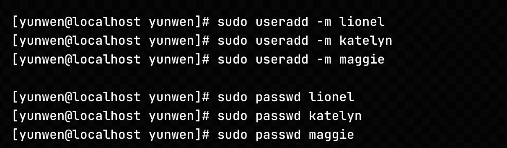
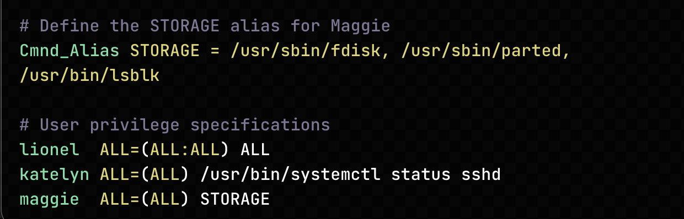


---

## Lab 2 – Disabling the sudo timer

### Objective

Understand and change `sudo` authentication caching (the “sudo timer”) behaviour.

### Background

By default, `sudo` caches authentication briefly. If a session is left unattended, that cache can be a security risk.

### Procedure

1. Ran several `sudo` commands to observe default caching behaviour.
2. Ran `sudo -k` to invalidate cached credentials.
3. Edited sudoers to require re-authentication every time (e.g. by setting the timestamp timeout to `0`).
4. Re-tested command execution.
5. Applied a user-specific timeout configuration for Lionel and verified it behaved independently.

### Results

- With timeout set to `0`, a password was required for every privileged command.
- Per-user settings applied as expected.

### Analysis

Disabling the timer hardens shared or high-risk environments but can reduce convenience.

### Conclusion

Sudo timeout values should match the organisation’s security and usability balance.

### Figures (Lab 2)

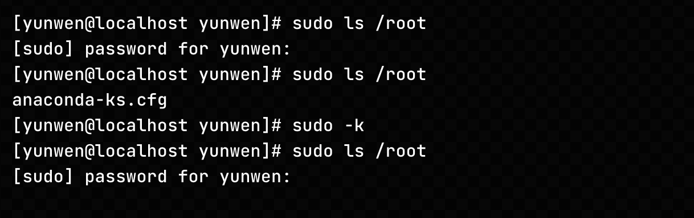


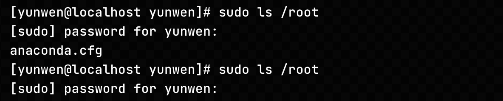

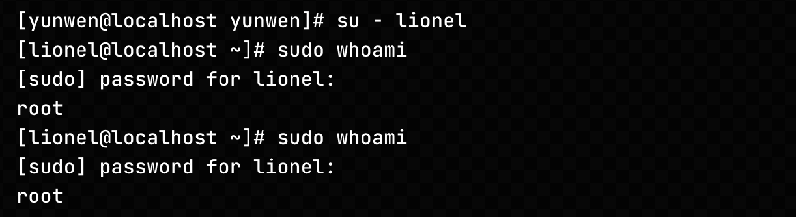


---

## Lab 3 – Encrypted home directory

### Objective

Create and manage an encrypted home directory.

### Background

Encrypting user data improves confidentiality, including against unauthorised physical access.

### Procedure

1. Installed `ecryptfs-utils`.
2. Created user **Cleopatra** with an encrypted home directory.
3. Logged in as that user and retrieved the encryption passphrase when prompted.

### Results

- The home directory encrypted successfully.
- Data was not readable without proper authentication.

### Analysis

Encryption adds protection beyond ordinary file permissions.

### Conclusion

Encrypted home directories are a practical control for sensitive user data.

### Figures (Lab 3)


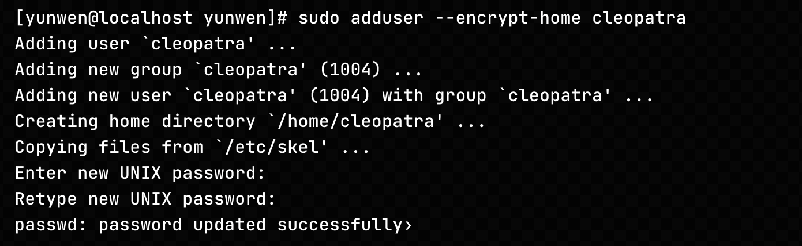

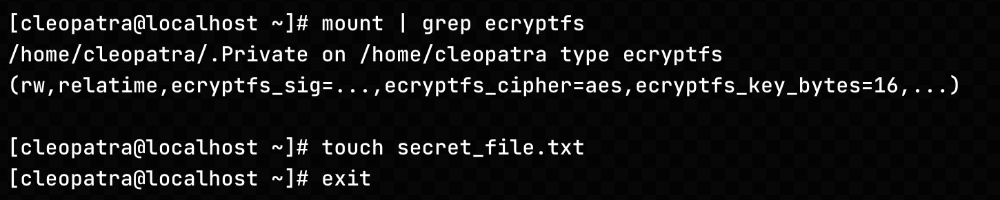


---

## Lab 4 – Password complexity criteria

### Objective

Enforce strong password policy on the system.

### Background

Weak passwords remain a common and serious weakness.

### Procedure

1. Configured the system password policy (e.g. PAM / authselect-related settings as required by the lab environment).
2. Set minimum password length.
3. Tested rejection of weak passwords and acceptance of stronger ones.
4. Configured complexity rules using character classes.

### Results

- Weak passwords were rejected.
- Complex passwords were accepted.

### Analysis

Complexity rules materially reduce the success rate of brute-force and guessing attacks.

### Conclusion

Strong password policy is a baseline control for system security.

### Figures (Lab 4)

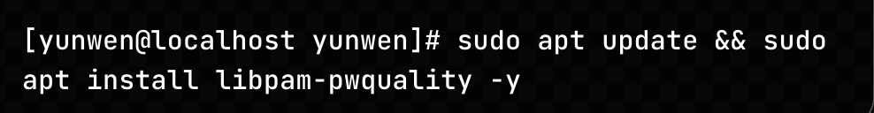

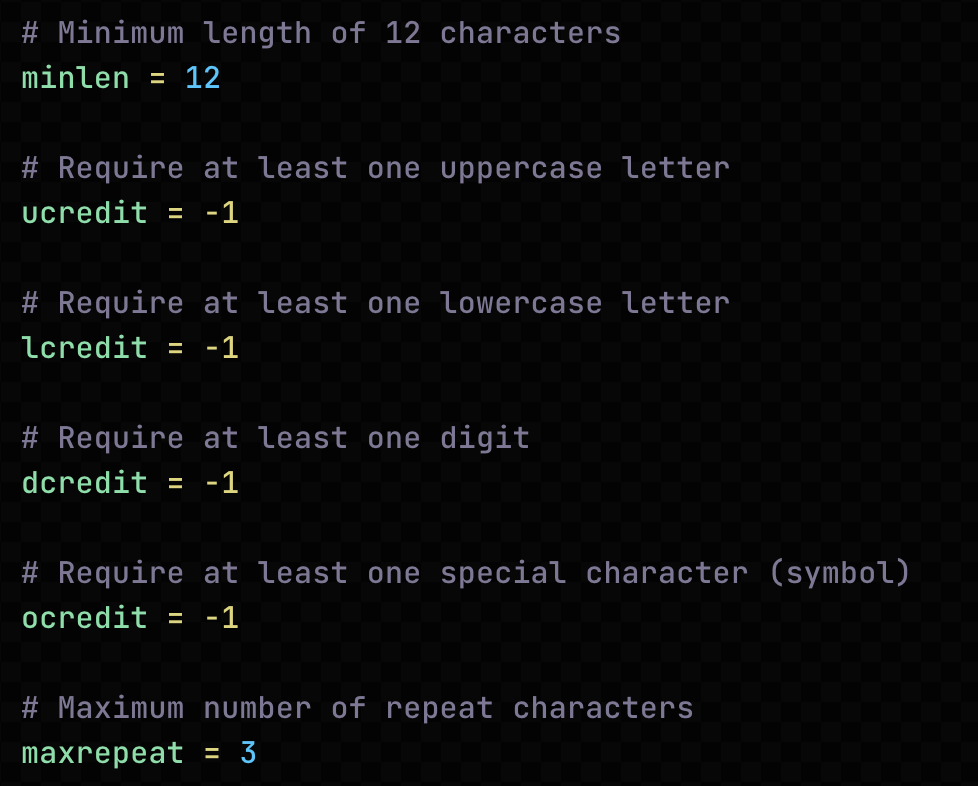
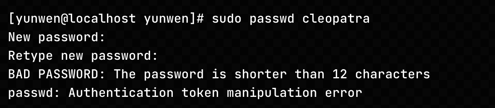
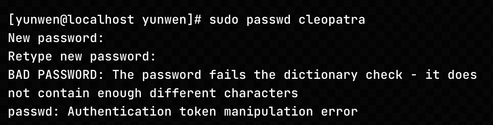
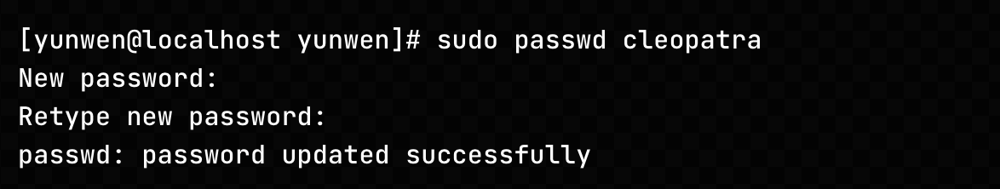


---

## Lab 5 – Account and password expiry

### Objective

Manage account lifecycle and password ageing.

### Background

Account expiration limits risk from dormant or forgotten accounts.

### Procedure

1. Created user **Samson** with an account expiration date.
2. Adjusted the expiration date and confirmed the change.
3. Forced a password change on first login where required by the exercise.
4. Configured password ageing policies (`chage` and related settings).

### Results

- Expiry dates applied as configured.
- Password changes were enforced according to policy.

### Analysis

Lifecycle management reduces long-term exposure from stale credentials and accounts.

### Conclusion

Account and password expiration are important in maintained, security-conscious environments.

### Figures (Lab 5)


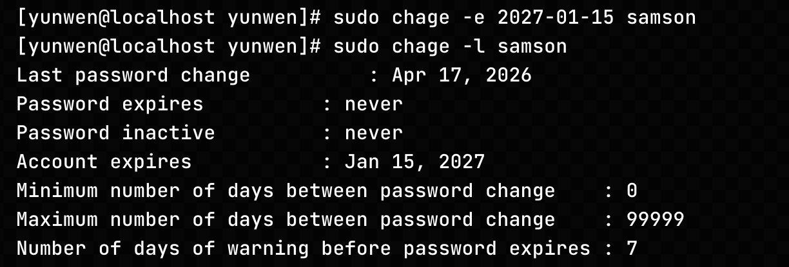
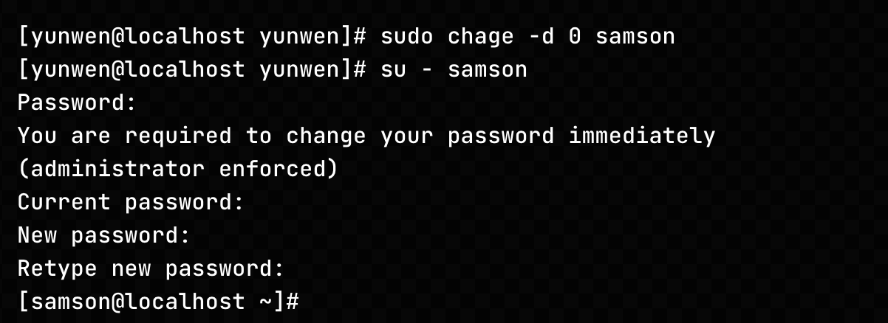


---

## Lab 6 – Detecting compromised passwords

### Objective

Check candidate passwords against known breach data.

### Background

Many users reuse passwords that already appear in public breach corpora.

### Procedure

1. Queried the **Pwned Passwords** API (k-anonymity hash prefix flow as specified in the lab).
2. Ran the provided or written script to test sample passwords.

### Results

- Commonly breached passwords were flagged.
- Unique passwords showed no matches.

### Analysis

Breach-aware checks help catch unsafe passwords before they enter production use.

### Conclusion

Integrating breach checks improves overall credential hygiene.

### Figures (Lab 6)

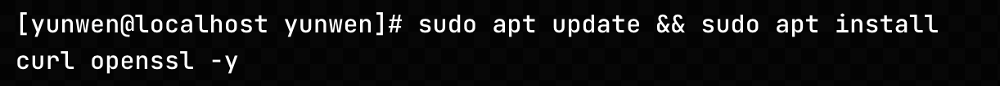

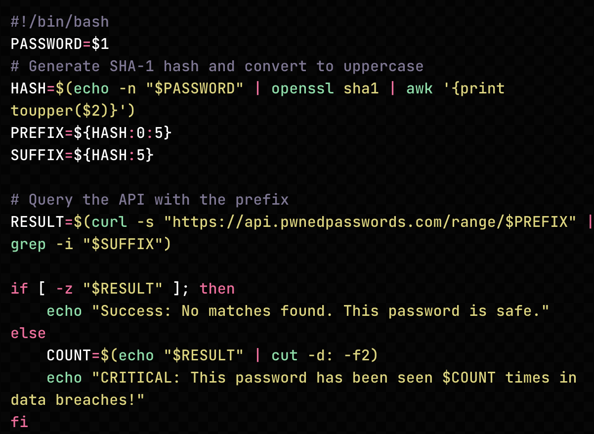
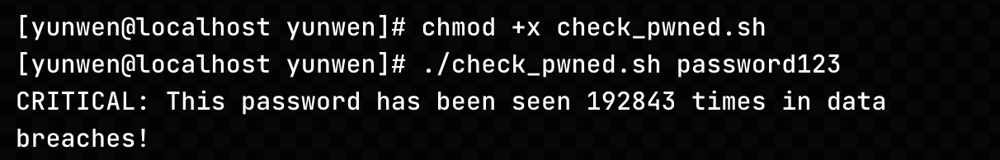


---

## Lab 7 – Configuring pam_tally2

### Objective

Lock accounts after repeated failed login attempts.

### Background

Brute-force attacks depend on being able to try many passwords quickly.

### Procedure

1. Modified the appropriate PAM stack to use tallying / lockout (e.g. `pam_tally2` or distribution equivalent as used in the lab VMs).
2. Set lockout threshold and unlock behaviour / time.
3. Simulated failed logins until lockout occurred.
4. Cleared or reset the tally manually as part of recovery testing.

### Results

- The account locked after enough failed attempts.
- Clearing the condition required administrative steps as designed.

### Analysis

Lockout throttles online guessing and forces attackers to slow down or switch targets.

### Conclusion

Login attempt limits are an essential part of host authentication hardening.

### Figures (Lab 7)


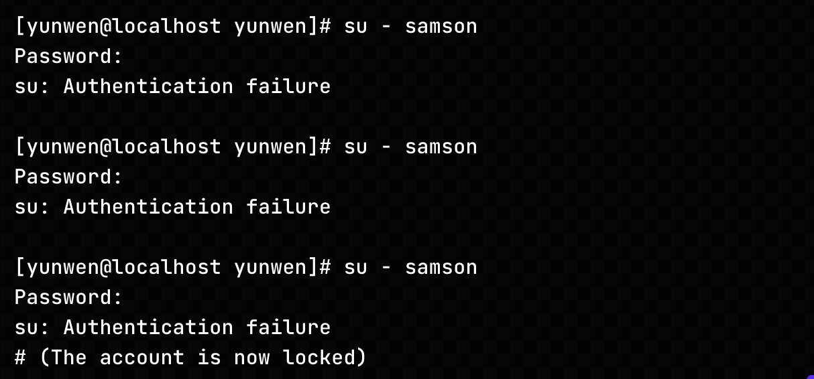
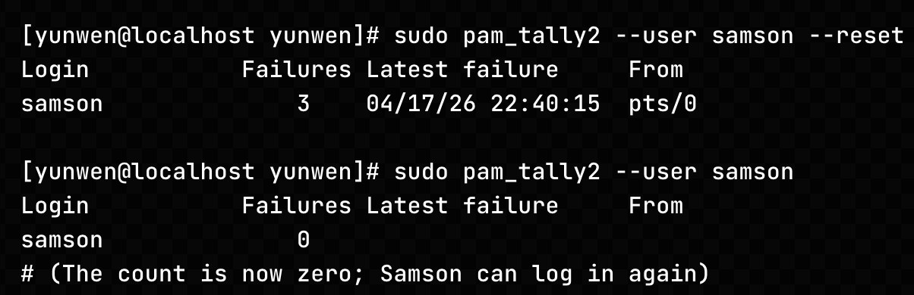


---

## Lab 8 – Distributed identity management

### Objective

Explore centralised identity management with **FreeIPA**.

### Background

Creating users separately on every machine does not scale and is error-prone.

### Procedure

1. Installed FreeIPA server components and dependencies.
2. **Administrative authentication:** obtained a Kerberos ticket so `ipa` administrative commands work (without a ticket, `ipa` fails as expected).
3. Configured centralised authentication for the lab domain.
4. **Client enrollment:** joined additional hosts so they trust the same directory and Kerberos realm.

### Results

- Users could be managed from the central directory.

### Analysis

Central IAM improves consistency, auditability, and operational efficiency at scale.

### Conclusion

Directory services such as FreeIPA simplify administration in larger Linux estates.

### Figures (Lab 8)

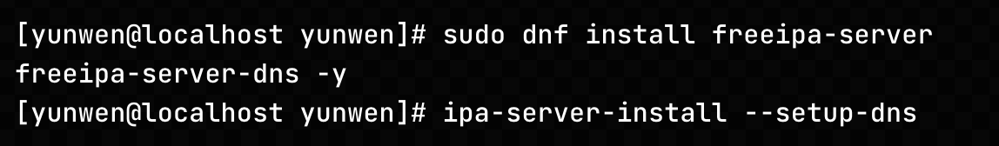
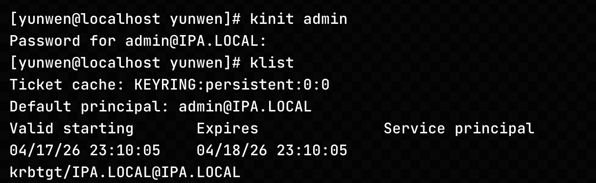
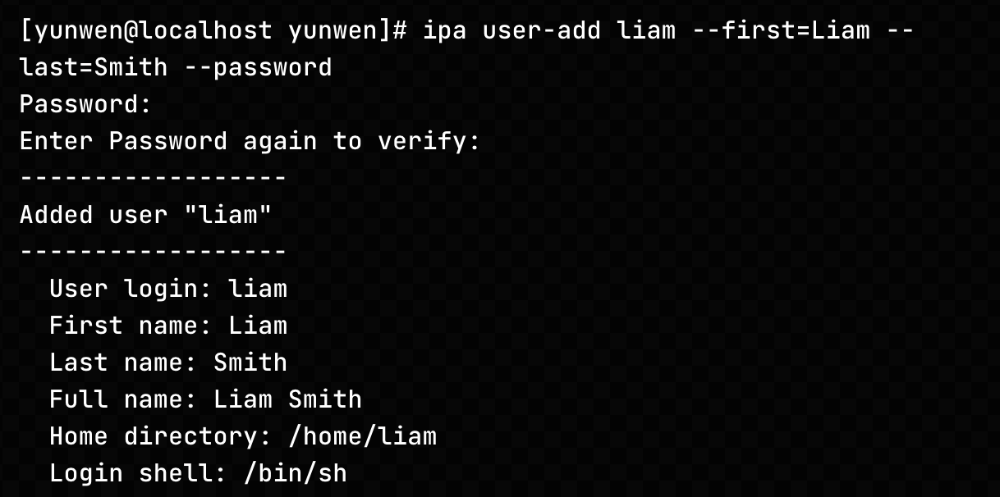

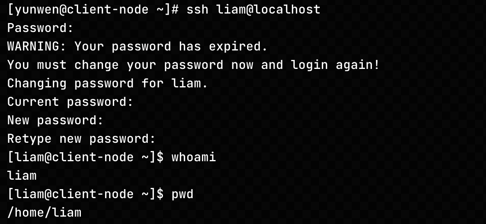


---

## Lab 9 – SUID and SGID files

### Objective

Identify and reason about **SUID** and **SGID** executables.

### Background

SUID/SGID binaries run with elevated effective privileges; they are high-value audit targets.

### Procedure

1. Scanned the filesystem for SUID/SGID files.
2. Created a test binary with the SUID bit set.
3. Compared scan output before and after to confirm detection.

### Results

- The new SUID file appeared in the inventory.

### Analysis

Unreviewed SUID/SGID programs expand the attack surface.

### Conclusion

Regular audits are required to control privilege escalation paths.

### Figures (Lab 9)

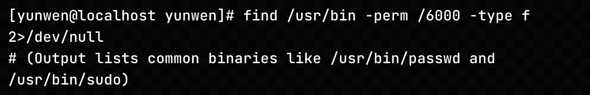
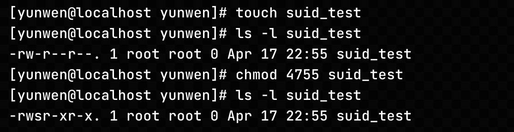


---

## Lab 10 – File attributes

### Objective

Use extended **immutable** and **append-only** attributes to protect files.

### Background

Linux file attributes add controls that complement standard DAC permissions.

### Procedure

1. Created a test file.
2. Applied append-only (`a`) and immutable (`i`) attributes with `chattr` as appropriate.
3. Attempted edits, deletes, and appends to compare behaviour.

### Results

- Append-only allowed new data at the end but blocked other modifications as expected.
- Immutable blocked changes entirely.

### Analysis

These attributes are strong integrity controls, including against mistakes by privileged users.

### Conclusion

File attributes are a useful part of a defence-in-depth strategy.

### Figures (Lab 10)

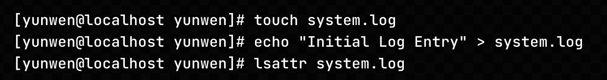
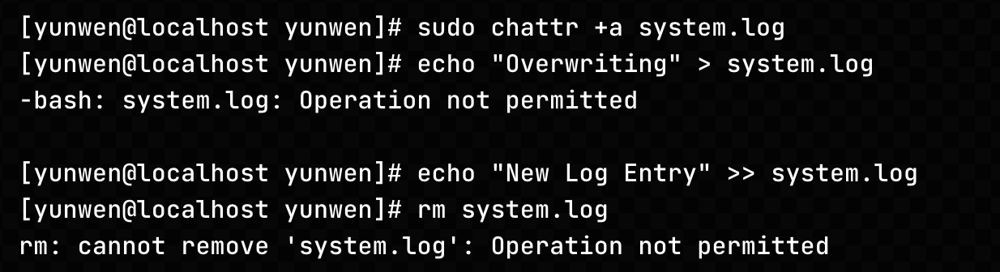
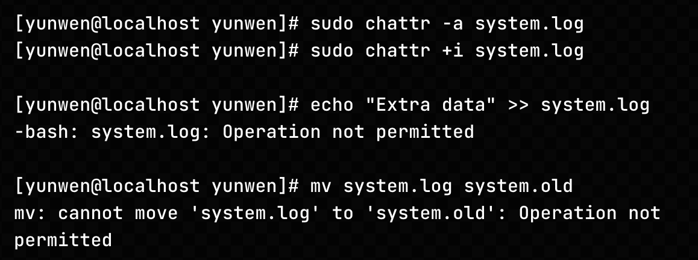


---

## Lab 11 – Shared group directory

### Objective

Configure a shared directory for group collaboration with tight permissions.

### Background

Shared workspaces need explicit permission design so users can cooperate without over-sharing.

### Procedure

1. Created a group and member users.
2. Configured the shared directory (ownership, mode, SGID/sticky semantics as required).
3. Applied **ACLs** where needed for fine-grained access.
4. Verified allowed and denied operations per user.

### Results

- Authorised collaboration worked.
- Unauthorised actions were blocked.

### Analysis

Combining standard permissions, SGID, sticky bit, and ACLs supports secure shared storage.

### Conclusion

Deliberate permission design is essential for any multi-user project directory.

### Figures (Lab 11)

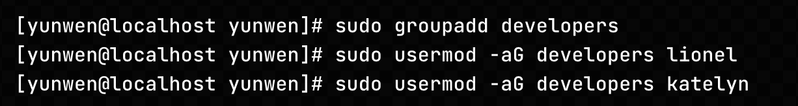
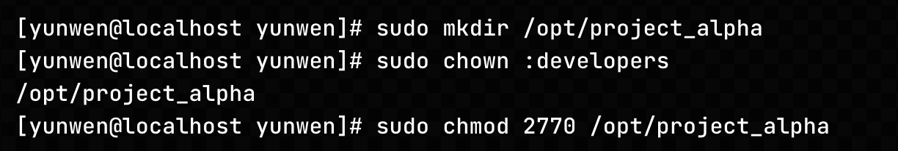
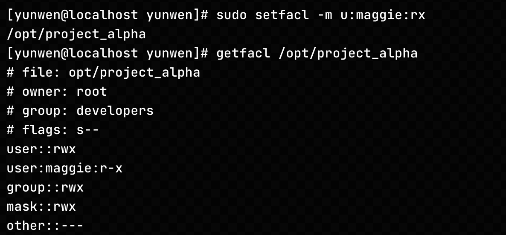
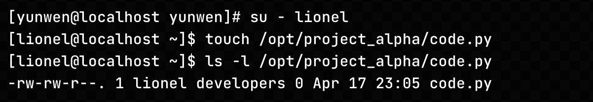
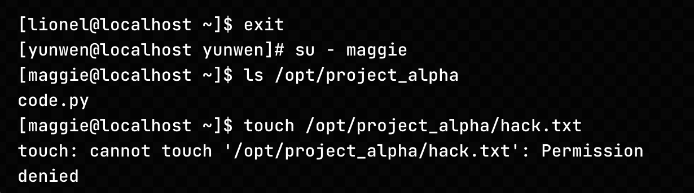


---

## Lab 12 – SELinux type enforcement

### Objective

Understand **SELinux** security contexts and type enforcement.

### Background

SELinux enforces **mandatory** access control on top of traditional DAC.

### Procedure

1. Installed the Apache HTTP server (or used the lab-provided web stack).
2. Published a simple test page.
3. Intentionally set an incorrect SELinux file context and observed access denial.
4. Restored the correct context (e.g. with `restorecon`) and confirmed service behaviour returned to normal.

### Results

- Wrong context led to denied access despite permissive-looking DAC settings.
- Restoring labels fixed the issue.

### Analysis

SELinux decisions depend on context and policy, not only Unix permission bits.

### Conclusion

SELinux adds a strong policy layer against lateral movement and misconfiguration.

### Figures (Lab 12)


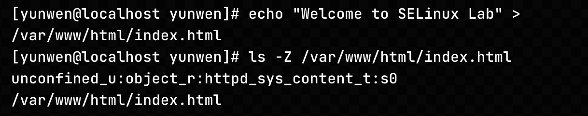
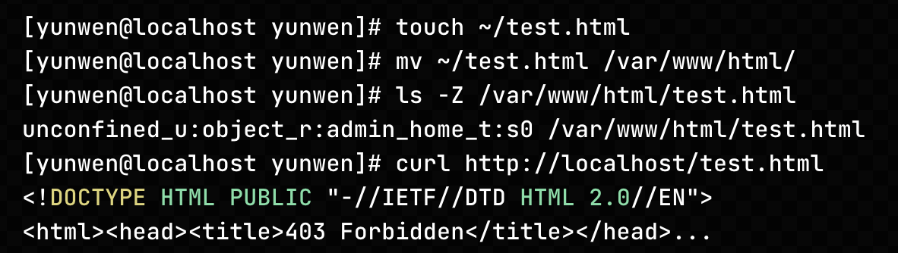
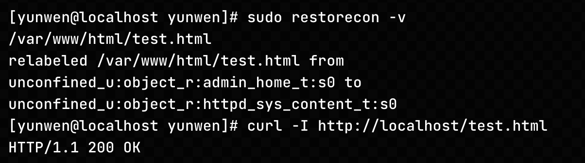


---

## Overall conclusion: strengthening the Linux security perimeter

The series of labs shows that Linux host security is not a single switch but a **layered architecture** built around the **principle of least privilege**. Moving from basic account controls toward mandatory access control yields a credible **defence-in-depth** posture.

### Key pillars

- **Granular privilege management:** `sudo` limited users such as Katelyn and Maggie to exactly what their roles require. Disabling the sudo timer reduced “walk-away” risk from cached credentials.
- **Data confidentiality and integrity:** Encrypted home directories protect data at rest; immutable and append-only attributes protect critical files from tampering, including by privileged users who bypass DAC expectations.
- **Identity and access control:** Password complexity, breach checks, and `pam_tally2` lockout raised authentication assurance. **FreeIPA** illustrated how central IAM scales with less drift than per-host user management.
- **Proactive auditing and hardening:** SUID/SGID reviews and SELinux type enforcement reduce silent privilege escalation and confine services when labels or binaries change.

### Final assessment

A secure Linux system is a moving target. The shift from **discretionary access control (DAC)**, where users largely govern their own objects, to **mandatory access control (MAC)**, where kernel policy decides what is safe, matches how modern infrastructure is attacked and defended.

Automation (`chage`, `restorecon`, directory-backed identity) keeps this complexity manageable. **Regular auditing** and **consistent policy application** are what allow the posture to keep pace with evolving threats.

---

## Repository layout

```text
iam_lab_01/
├── README.md
├── IAM LAB REPORT (LABS 1–12).pdf
├── DETAILED LAB REPORT (LABS 1–12).md   # export with embedded figures
└── screenshot/
    ├── lab1.png
    ├── …
    └── lab53.png
```
